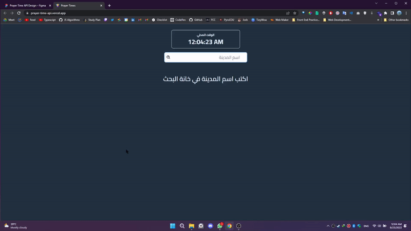

# City prayer time API 🕌

This project was done by using the open-source [Aladhan API](https://aladhan.com/) which has many Islamic API options to use in Islamic sites or sites visited by Muslims.

## What is Prayer Times API?

Prayer Times API has many endpoints that return JSON including the Five Prayers times in a specific city, country, address, or an exact month of the year.

## Timings By City

In this project I used the Timing By City endpoint to search for prayer times based on the city written.

## Preview 📺

## Tools Used ⚙️

- [React](https://reactjs.org/) - JS library
- [Tailwind CSS](https://tailwindcss.com/) - CSS framework
- [Framer Motion](https://www.framer.com/motion/) - A production-ready motion library for React.

## Created By Mohanad ✍️

- Website - [Mohanad Portfolio](https://portfolio-mohanadoo.vercel.app/)
- Frontend Mentor - [@MohanadOO\_](https://twitter.com/MohanadOO_)
- Twitter - [@Mohanad_OOO](https://twitter.com/Mohanad_OOO)
